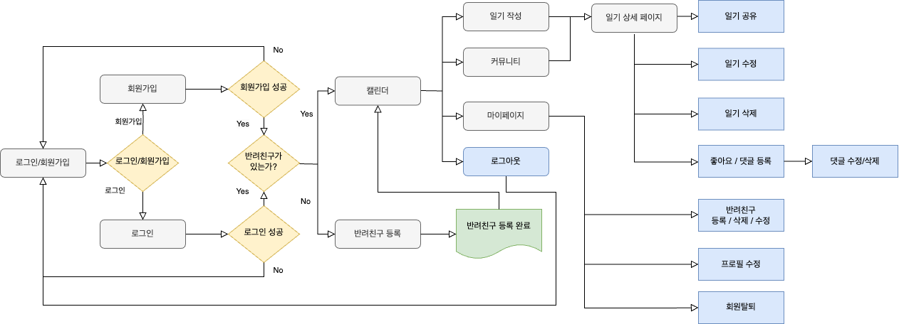
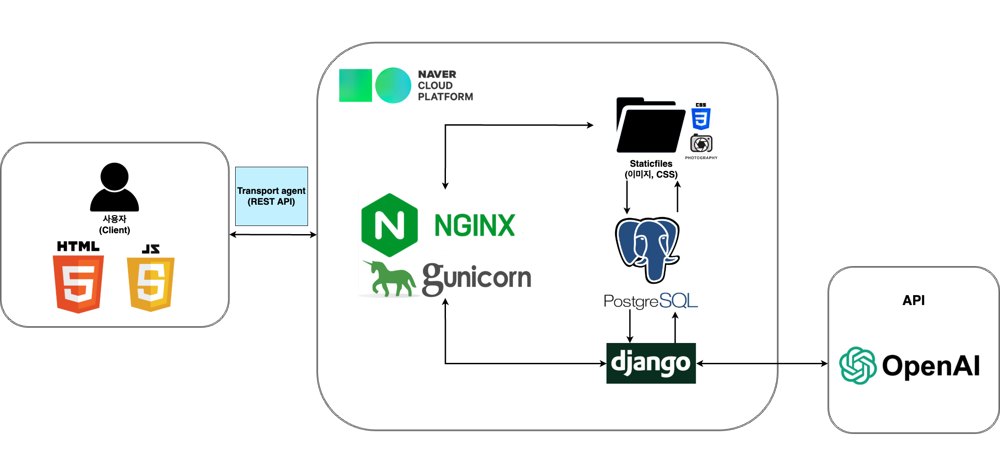
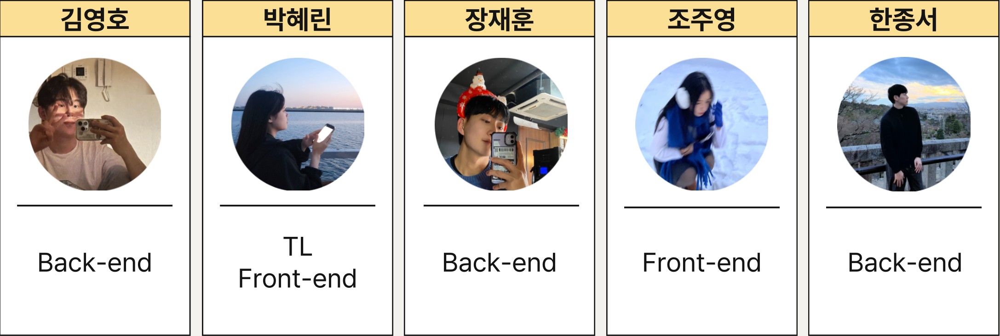

# 📝 On-Record(온기록)
### 🍀 피로그래밍 22기 최종 프로젝트
📆 **개발 기간**: 2025년 01월 27일 ~ 2025년 02월 18일
### 📂 Contents
1. [☀️ 서비스 소개](#서비스-소개)
2. [💻 사용 툴](#사용-툴)
3. [📈 Flowchart](#Flowchart)
4. [🧱 System Architecture](#System-Architecture)
5. [📀 ERD](#ERD)
6. [🐶 팀원 소개](#팀원-소개)

## ☀️ 서비스 소개
.png)
> #### URL: [온기록 사이트](https://onrecord.kr "온기록 이용해보기")
> 반려동물이나 반려식물과의 추억을 기록하면, **AI**가 반려친구의 입장에서 답장을 생성해주는 웹서비스

온기록(온기 + 기록)은 반려동물 또는 반려식물을 키우는 사용자들이 자신의 반려친구와의 소중한 일상을 기록할 수 있도록 돕는 웹 서비스입니다.
반려동물뿐만 아니라 반려식물도 포함하여 보다 폭넓은 사용자층을 대상으로 하며, 감정과 날씨 등의 요소를 활용해 일상을 더욱 생동감 있게 기록할 수 있도록 설계되었습니다.

## 💻 사용 툴(Tools)

******

#### Front-End

    
    
    

******

#### Back-End

    
    
    
    
    
    

******

#### AI

    

 

**AI 답변 생성 방식**  
> - OpenAI의 **GPT 모델**을 사용하여 사용자의 일기에 대한 답변을 생성  
> - 작성한 일기와 반려친구의 정보 데이터를 반영하여 맞춤형 AI 응답 제공

******

### 🌟 협업 툴

    
    
    
    

 

> [🐶 온기록 노션](https://arrow-battery-d95.notion.site/18a0464afcbc81dfa1cac08ba4e57ffa)
&nbsp;&nbsp;&nbsp;[🌸 온기록 피그마](https://www.figma.com/design/UegG1gocuWCnORJeMuLayB/%EC%98%A8%EA%B8%B0%EB%A1%9D?node-id=0-1&p=f&t=MrHQne5S9sjzOato-0)

******

## 📈 Flowchart

 
**온기록 서비스의 동작 흐름**
> 1. 사용자가 **회원가입 후 로그인**
> 2. 반려동물 또는 반려식물을 **등록**
> 3. 캘린더에서 **날짜를 선택하여 일기 작성**
> 4. AI가 **반려친구의 입장에서 자동으로 답장 생성**
> 5. 사용자는 **AI 응답을 확인하고 감정 교류 가능**
> 6. 작성한 일기를 공개여부를 통해 다른 사람들과 **공유 가능**
> 7. 다른 사람들의 일기에 좋아요, 댓글로 **소통 가능**

## 🧱 System Architecture

## 📀 ERD

## 핵심 기능
> 1.	캘린더 기반 일기 작성 
	•	반려동물 및 반려식물을 대상으로 날짜별 일기 작성 
	•	감정(이모지) 및 날씨 선택 기능 
	•	다이어리 리스트 및 개별 일기 상세 보기 가능
> 2.	AI 답변 생성 기능 
	•	사용자가 작성한 일기에 대해 AI가 반려친구(동물/식물)의 입장에서 답장을 생성 
	•	AI 응답을 통해 사용자와 반려친구 간의 인터랙션을 강화
> 3.	반려친구 관리 기능 
	•	반려동물 및 반려식물 등록 및 삭제 기능 
	•	반려친구의 사진, 이름, 성격 등을 추가하여 맞춤형 관리 가능
> 4.	공개/비공개 설정 
	•	일기별로 전체 공개/비공개 설정이 가능하여 프라이버시 보호 
	•	향후 커뮤니티 기능과 연계 가능

## 사용 예시
#### 1.	회원가입 및 로그인
 
	•	회원가입 후, 로그인하여 반려친구를 등록할 수 있는 초기 설정 페이지로 이동 
    
 

#### 2.	반려친구 등록
 
	•	반려동물 또는 반려식물 추가
	 
    
     
	•	사진 업로드, 특징, 성격 설정 등의 기능을 통해 개별 맞춤 설정
     
    

	
	
    

     
    
#### 3.	캘린더 화면에서 일기 작성
 
	•	원하는 날짜를 선택 후, 반려친구를 지정하여 일기 작성 
    
     
    
#### 4.  일기 작성
 
    •	감정 및 날씨 선택, 텍스트 입력 기능 제공 
    
     
    
#### 5.	AI 답변 확인
 
	•	작성한 일기에 대해 AI가 반려친구의 입장에서 답장을 자동 생성 
	•	감정 분석을 기반으로 자연스러운 반응 제공 
    
     
    
#### 6.	일기 리스트 및 상세보기
 
	•	기록된 일기를 캘린더 혹은 리스트 뷰에서 확인 
	•	특정 일기 클릭 시, 상세 페이지로 이동하여 전체 내용 및 AI 답장 확인 가능
     
    
     
    
#### 7.	반려친구 관리 및 삭제 기능(마이페이지)
 
	•	반려친구 추가/수정/삭제 가능
  
	•	반려친구 데이터와 함께 기존의 작성된 일기들도 함께 삭제
     
    
     
    
#### 8. 커뮤니티 기능(모두의 온기록)
 
    

## 🐶 팀원 소개
| 역할 | 이름 | 깃허브 |
|-------|-------|-------|
| **TL / FE** | 박혜린 | [mangoooooo1](https://github.com/mangoooooo1 "박혜린 Github") |
| **FE** | 조주영 | [cestjeudi](https://github.com/cestjeudi "조주영 Github") |
| **BE** | 김영호 | [0HooHI](https://github.com/0HooHI "김영호 Github") |
| **BE** | 장재훈 | [l-wanderer01](https://github.com/l-wanderer01 "장재훈 Github") |
| **BE** | 한종서 | [Dosp74](https://github.com/Dosp74 "한종서 Github") |

